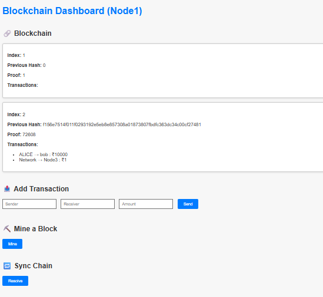
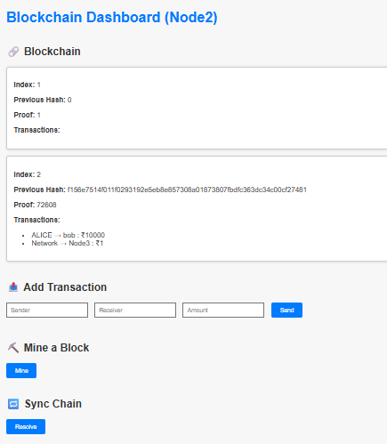
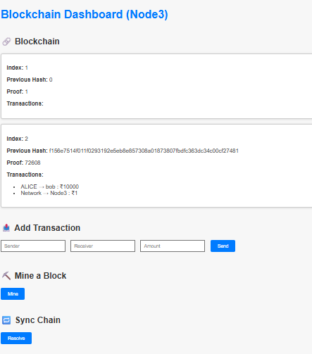

#  Blockchain P2P

A simple peer-to-peer blockchain network built with Flask and Python. Nodes can add transactions, mine blocks, and resolve chains.

---

##  Features

-  Add new transactions
-  Mine new blocks
-  Sync chain across nodes
-  Proof of Work implementation
-  Flask-based dashboard for each node

---

##  Tech Stack

- Python 3
- Flask
- HTML (Jinja templates)
- REST API
- Bootstrap (optional for styling)

---

  
  


---

## How to Run

```bash
# Install dependencies
pip install flask

# Run Node 1
python node1.py

# Run Node 2 (in a new terminal)
python node2.py

# Run Node 3 (in a new terminal)
python node3.py
```

---

##  How It Works

- Each node acts as a separate instance of the blockchain and runs on a different port.
- You can interact with each node through its Flask dashboard.
- Transactions are added using the form.
- Mining a block calculates the proof of work and creates a new block containing current transactions.
- Nodes can sync using the “Resolve” button, which replaces their chain with the longest valid chain found among registered peers.
- All communication is done via REST API behind the scenes.

---

##  Credits

Created by **Inniya Rajasundar**  
Built as part of a peer-to-peer blockchain learning project using Python and Flask.

